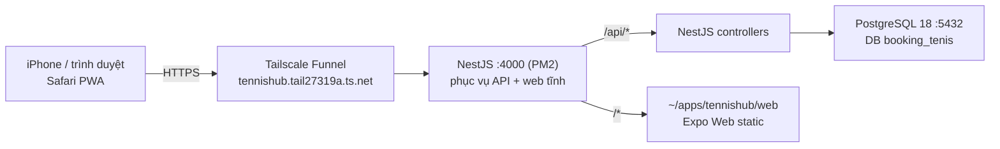

# HANDOFF — TennisHub (cập nhật 2026-09-29)

> **Mục đích file này:** bàn giao toàn bộ ngữ cảnh cho một AI agent (hoặc thành viên mới) đọc để hiểu
> **đã làm gì, tại sao, còn gì chưa xong**. Đọc hết file này trước khi sửa code.
>
> **Trạng thái:** app **đã chạy production công khai** ở `https://tennishub.tail27319a.ts.net`.
> **⚠️ Có lỗ hổng bảo mật CHƯA vá — xem mục 6 trước khi chia sẻ URL cho ai.**

---

## 1. Bối cảnh dự án

| | |
|---|---|
| Sản phẩm | TennisHub — tìm và đặt sân thể thao (30 sân, 135 booking) |
| Repo | 2 project độc lập, **không có `package.json` ở gốc** |
| `client/` | Expo SDK 57 / React Native 0.86.3 / React 19.2.3 / TypeScript 6.0.3 / NativeWind 4 + Tailwind 3 |
| `server/` | NestJS 11 / Prisma 7 (`@prisma/adapter-pg`) / PostgreSQL 18 |
| Ngôn ngữ | Code, comment và docs **viết bằng tiếng Việt** |
| Docs gốc | `README.md`, `client/CASE.md`, `server/CASE.md`, `client/CODING_GUIDELINES.md`, `client/AGENTS.md` |

Quy ước build: mỗi sub-project có `pnpm-workspace.yaml` riêng → **luôn `cd` vào đúng thư mục trước khi chạy lệnh**.
Root `CLAUDE.md` yêu cầu prefix lệnh shell bằng `rtk` (token-saving wrapper).

---

## 2. Trạng thái production hiện tại



| Hạng mục | Giá trị |
|---|---|
| **URL công khai** | `https://tennishub.tail27319a.ts.net` (HTTPS, Tailscale Funnel, port 443) |
| Web app | `/` (PWA) · `/admin` (quản trị) · `/api/docs` (Swagger) |
| API health | `GET /api/health` → `{"database":"up","status":"ok","venues":30}` |
| Server | `ssh 192.168.100.69` — user `khaipd-cloud`, Ubuntu 26.04, 8 core / 15 GiB, Wi-Fi `wlp6s0` |
| Thư mục app | `~/apps/tennishub/{server,web}` |
| PM2 | process `tennishub-api` (port 4000) · boot: `pm2-khaipd-cloud.service` (enabled) |
| **Chung máy** | `mocphim-api` của project khác đang chạy ở **port 8080** — **KHÔNG được đụng vào** |
| PostgreSQL | role `tennishub`, DB `booking_tenis`, owner `tennishub` |
| 24/7 | `HandleLidSwitch=ignore`; `sleep.target`, `suspend.target`, `hibernate.target` đều **masked** |

### Nơi lưu secret (KHÔNG copy ra ngoài server)

| Secret | Vị trí |
|---|---|
| Mật khẩu DB production | `~/.tennishub_db_pw` (chmod 600) trên server |
| `JWT_SECRET`, `SEPAY_WEBHOOK_API_KEY`, `DATABASE_URL`, `CORS_ORIGIN`, `WEB_ROOT` | `~/apps/tennishub/server/.env` (chmod 600) trên server |
| Mật khẩu SSH | user tự giữ (đã lộ trong chat một lần — **cần đổi**) |

`server/.env` và `client/.env` đều đã gitignore → **không bao giờ commit secret**.

---

## 3. Việc đã làm trong phiên này

### 3.1. Nâng Expo SDK 54 → 57 (`client/`) — commit `79f8b83`

**Nguyên nhân:** Expo Go trên iOS chỉ chạy được SDK mới nhất. Máy đã cài Expo Go SDK 57 nhưng project ở SDK 54 →
lỗi *"Project is incompatible with this version of Expo Go"*, và trên iOS **không thể cài Expo Go bản cũ**.

Đã nâng theo đúng ma trận của SDK 57 (nguồn: `unpkg.com/expo@57.0.25/bundledNativeModules.json` + template `expo-template-default@sdk-57`):

| | Trước | Sau |
|---|---|---|
| `expo` | ~54.0.37 | ~57.0.25 |
| `react-native` | 0.81.5 | 0.86.3 |
| `react` / `react-dom` | 19.1.0 | 19.2.3 |
| `expo-router` | ~6.0.24 | ~57.0.23 |
| `react-native-reanimated` / `worklets` | ~4.1.1 / 0.5.1 | 4.5.1 / 0.10.1 |
| `typescript` | ~5.9.2 | ~6.0.3 |
| `@types/react` | ~19.1.10 | ~19.2.2 |

Các package `expo-*` chuyển sang scheme thống nhất SDK 55+ (`expo-image` 3 → 57, `expo-status-bar` 3 → 57…),
`@react-native-community/datetimepicker` 8.4.4 → 9.1.0, `react-native-svg` 15.12.1 → 15.15.4,
`react-native-webview` 13.15.0 → 13.16.1, `nativewind` 4.2.6 → 4.2.7.

**Breaking change đã xử lý:**
- `app.json`: gỡ `newArchEnabled` (SDK 55 bỏ legacy arch) và `android.edgeToEdgeEnabled` (SDK 55 bắt buộc edge-to-edge).
- `SepayCheckoutSheet/index.tsx`: eslint-config-expo 57 bật rule `react-hooks/set-state-in-effect`.
  Khối reset state theo `paymentId` được viết lại thành **adjust state during render** (ref vẫn reset trong effect
  vì rule `react-hooks/refs` cấm ghi ref lúc render).
- Bỏ qua các breaking change không ảnh hưởng: `expo-router` tách khỏi `react-navigation` (không có import
  `@react-navigation/*`), `expo/fetch` thành `globalThis.fetch` (chỉ dùng fetch đơn giản), `expo-av` (không dùng),
  `@expo/vector-icons` (không dùng), `expo-blur` (không dùng).

**Docs đã đồng bộ SDK 54 → 57:** `README.md`, `client/README.md`, `client/CASE.md`, `server/CASE.md`.
Trước đó các docs này ghi rõ "project chốt SDK 54 vì Expo Go 54.x là bản mới nhất trên App Store" — đó chính là
nguồn gốc của lỗi.

### 3.2. Sửa lỗi "Không kết nối được máy chủ" (ApiError 0)

**Nguyên nhân thật:** `EXPO_PUBLIC_*` được **nhúng cứng vào bundle lúc build**. Dev server khởi động lúc `01:05:50`,
`client/.env` được sửa lúc `01:08:01` → bundle đang chạy vẫn giữ giá trị cũ `http://localhost:4000/api`.
Trên iPhone, `localhost` là **chính điện thoại** → `fetch` ném lỗi → `lib/api/http.ts` bọc thành `ApiError(..., 0)`.

**Cách chẩn đoán (giữ lại để tái sử dụng):**
```powershell
Invoke-WebRequest 'http://localhost:8081/node_modules/expo-router/entry.bundle?platform=ios&dev=true&minify=false' -OutFile b.js
# tìm dòng: "EXPO_PUBLIC_API_URL": { enumerable: true, value: "..." }
```

**Bài học:** sửa `.env` **phải restart dev server**. Không có hot-reload cho biến env.

### 3.3. Lỗi "You need to be signed in to Expo Go and Expo CLI"

Trên **thiết bị iOS thật**, Expo Go từ chối mở project từ dev server nếu **Expo CLI và Expo Go không đăng nhập
cùng một tài khoản Expo**. Android/emulator/simulator không bị.
Kiểm tra: `npx expo whoami`. Sửa: `npx expo login` + đăng nhập trong Expo Go (icon tài khoản góc phải trên) + "Try again".

*(Sau khi deploy production theo cách ở mục 3.4 thì **không cần Expo Go nữa**.)*

### 3.4. Triển khai production lên máy nhà `192.168.100.69`

**Quyết định thiết kế quan trọng — và lý do:**

| Quyết định | Lý do |
|---|---|
| **NestJS phục vụ luôn web tĩnh** (`useStaticAssets` + SPA fallback trong `server/src/main.ts`) | 1 origin duy nhất → **hết vấn đề CORS**, không cần cài Caddy/nginx, chỉ 1 process, 1 port |
| **Web build dùng `EXPO_PUBLIC_API_URL=/api`** (đường dẫn tương đối) | Cùng một artifact chạy được cả LAN lẫn URL công khai → **không phải build lại khi đổi domain** |
| **PWA thay cho native app** (thêm `apple-touch-icon`, sửa `manifest.json`) | iOS **không có cách nào miễn phí** để cài app native (TestFlight cần Apple Developer 99$/năm; free provisioning cần Mac + hết hạn 7 ngày). PWA: 0đ, không hết hạn, không cần Expo Go |
| **Tailscale Funnel** thay vì mở port router | Máy nhà thường bị CGNAT; Funnel không cần mở port, có TLS miễn phí, phone không cần cài Tailscale |
| **PM2 + PostgreSQL native** thay vì Docker | Theo lựa chọn của chủ dự án; máy đã có sẵn Node 22, PM2 7.0.3, PostgreSQL 18.6 |
| **Copy dữ liệu dev lên production** (`pg_dump -Fc` → `scp` → `pg_restore`) | Theo yêu cầu; giữ nguyên 30 sân/10 user/135 booking và cả bảng `_prisma_migrations` nên `migrate deploy` là no-op |

**Các bước đã thực hiện:**
1. Cài SSH key lên server (user tự gõ mật khẩu 1 lần) → từ đó `ssh 192.168.100.69` không cần mật khẩu.
2. Recon máy đích **trước khi cài gì** (OS, RAM, disk, Node, Postgres, PM2, port đang dùng).
3. Cấp tạm `NOPASSWD` sudo, **xoá lại sau khi deploy xong**.
4. Tạo role `tennishub` + DB `booking_tenis`; mật khẩu **sinh ngay trên server** (`openssl rand -hex 24`), lưu `~/.tennishub_db_pw`.
5. `pg_dump` DB dev → `scp` → `pg_restore` (17 bảng, 30 Venue, 10 User, 135 Booking, 4 migration).
6. Viết `.env` production **trên server**: `JWT_SECRET` 96 ký tự, `SEPAY_WEBHOOK_API_KEY` 64 ký tự, `DATABASE_URL` cho role mới.
7. Cài pnpm **không cần sudo** (`mkdir -p ~/.local/bin` rồi `corepack enable --install-directory`, fallback `npm install -g pnpm@11`).
8. `pnpm install --frozen-lockfile` → `prisma generate` → `prisma migrate deploy` → `nest build` — **build ngay trên server**.
9. `pm2 start dist/main.js --name tennishub-api --cwd ...` → `pm2 startup systemd` → `pm2 save`.
10. Cài Tailscale → Funnel 443 → `http://127.0.0.1:4000`.
11. Cập nhật `CORS_ORIGIN` thành URL công khai rồi `pm2 restart --update-env`.
12. Verify: `/api/health` 200 (~300 ms), `/`, `/bookings`, `/admin`, `/api/docs`, `manifest.json`, `apple-touch-icon.png` đều 200;
    route lạ → 404; `/api/*` lạ → JSON 404 (fallback không nuốt `/api`).

### 3.5. Commit

`dev` → `origin/dev` (`https://github.com/phanduykhai05/booking-tennis.git`):

| Commit | Nội dung |
|---|---|
| `79f8b83` | `chore(client)`: nâng Expo SDK 54 → 57, gỡ `newArchEnabled`/`edgeToEdgeEnabled`, fix lint, đồng bộ docs |
| `d9ad031` | `feat(deploy)`: NestJS phục vụ web cùng origin, thêm icon PWA cho iOS |
| `ea911f8` | `feat(map)`: tách `mapPin.ts` dùng chung cho Leaflet-native và Leaflet-web, thêm `OpenStreetMapCanvas.web.tsx` |

---

## 4. File đã thay đổi

| File | Thay đổi |
|---|---|
| `client/package.json` | toàn bộ ma trận dependency SDK 57 |
| `client/pnpm-lock.yaml` | lockfile mới |
| `client/app.json` | gỡ `newArchEnabled`, `android.edgeToEdgeEnabled` |
| `client/components/payments/SepayCheckoutSheet/index.tsx` | reset state theo `paymentId` chuyển sang lúc render |
| `client/app/+html.tsx` | thêm `<link rel="apple-touch-icon">` (thiếu nó iOS lấy ảnh chụp màn hình làm icon) |
| `client/public/manifest.json` | icons trỏ PNG thật thay vì `favicon.ico` khai 192×192 |
| `client/public/apple-touch-icon.png`, `icon-192.png`, `icon-512.png` | **mới** — sinh từ `client/assets/icon.png` (1024×1024) |
| `server/src/main.ts` | `NestExpressApplication` + `useStaticAssets` + SPA fallback, cờ `WEB_ROOT` |
| `README.md`, `client/README.md`, `client/CASE.md`, `server/CASE.md` | SDK 54 → 57 |
| `client/components/map/CourtMap/mapPin.ts` | **mới** — hằng số + helper ghim bản đồ dùng chung |
| `client/components/map/CourtMap/components/OpenStreetMapCanvas.web.tsx` | **mới** — bản đồ Leaflet chạy trên DOM cho web |
| `client/components/map/CourtMap/components/OpenStreetMapCanvas.tsx` | dùng helper chung (còn 2 import `focusZoom`, `pinHtml` chưa dùng → refactor dở dang) |

---

## 5. Kiến thức vận hành (runbook)

**Deploy lại sau khi đổi code:**
```bash
# 1. Trên máy dev: build web (bắt buộc EXPO_PUBLIC_API_URL=/api)
cd client && EXPO_PUBLIC_API_URL=/api npx expo export --platform web --output-dir dist
cp -r public/* dist/          # đảm bảo manifest + icon mới nhất

# 2. Đóng gói (KHÔNG kèm node_modules, dist, .git, .env)
cd .. && tar -czf server.tgz --exclude node_modules --exclude dist --exclude .git --exclude .env --exclude .expo server
tar -czf web.tgz -C client dist

# 3. Đẩy lên
scp server.tgz web.tgz 192.168.100.69:/tmp/
```

**Trên server:**
```bash
APP="$HOME/apps/tennishub"; export PATH="$HOME/.local/bin:$PATH"
rm -rf "$APP/server" "$APP/web"; tar -xzf /tmp/server.tgz -C "$APP"; tar -xzf /tmp/web.tgz -C "$APP"; mv "$APP/dist" "$APP/web"
cd "$APP/server" && pnpm install --frozen-lockfile && npx prisma generate && pnpm build
pm2 restart tennishub-api --update-env && pm2 save
```

**Lệnh thường dùng:**
```bash
pm2 list                            # trạng thái (để yên mocphim-api!)
pm2 logs tennishub-api --lines 50   # log app
pm2 logs tennishub-api --err        # log lỗi
curl -s http://127.0.0.1:4000/api/health
tailscale funnel status             # trạng thái Funnel
sudo tailscale funnel --bg --https=443 http://127.0.0.1:4000   # bật lại Funnel (cần mật khẩu sudo)
```
> Kiểm tra sau mỗi lần deploy: `systemctl is-enabled pm2-khaipd-cloud` phải là `enabled`, và `pm2 save` phải được chạy.

**Backup DB:**
```bash
export PGPASSWORD="$(cat ~/.tennishub_db_pw)"
pg_dump -h 127.0.0.1 -U tennishub -d booking_tenis -Fc -f ~/backup-$(date +%F).dump
```

---

## 6. ⚠️ NỢ BẢO MẬT — ĐỌC TRƯỚC KHI LÀM GÌ KHÁC

App đang **public trên internet**. Ba vấn đề dưới đây cộng lại khiến app gần như không được bảo vệ.

### P0 — `forgot-password` trả mã reset trong response (`server/src/modules/auth/auth.service.ts`)

```ts
return { code, expiresInMinutes: resetCodeTtlMinutes, sentTo: dto.phone ?? dto.email ?? '' };
```

Kẻ tấn công chỉ cần biết email/số điện thoại là **chiếm được tài khoản bất kỳ, kể cả ADMIN**:
`POST /api/auth/forgot-password` → đọc `code` trong response → `POST /api/auth/reset-password`.

Comment ngay trên hàm đã ghi *"khi có nhà cung cấp thật, chỉ cần bỏ trường `code` khỏi response"*,
và `server/CASE.md` (NFR-SEC-10) yêu cầu "Production không trả reset code". **Chưa làm.**

### P0 — Mật khẩu ADMIN là `123456`

Toàn bộ 10 tài khoản (copy từ dev) dùng chung mật khẩu seed `123456` (`server/prisma/seed.ts`).
Tài khoản ADMIN: `admin@tennishub.vn` / SĐT `0847968368`.

### P0 — Không có rate limit trên endpoint auth

`login`, `forgot-password`, `reset-password` cho phép thử không giới hạn → brute-force mã 6 số (10^6 khả năng)
hoặc mật khẩu `123456`. Chưa có `@nestjs/throttler`.

### P1 — Các mục khác từ `CASE.md` chưa xử lý

- Token lưu ở `AsyncStorage` (app) / `localStorage` (web) — nên chuyển `expo-secure-store` + HttpOnly cookie cho web.
- Chưa có security headers/CSP, chưa redirect HTTP → HTTPS.
- `SEPAY_ACCOUNT_NUMBER` / `BANK_CODE` / `ACCOUNT_NAME` vẫn là **giá trị dev giả**, chưa khai báo webhook SePay.

### Đề xuất thứ tự vá

1. Bỏ `code` khỏi response khi ở production; chỉ trả khi bật cờ `EXPOSE_RESET_CODE=true`; production ghi code vào log
   (`pm2 logs`) để vẫn test được.
2. Đổi mật khẩu ADMIN sang chuỗi mạnh; **cân nhắc đổi/xoá 9 tài khoản seed** trên production.
3. Thêm `@nestjs/throttler` (ví dụ 5 req/phút/IP cho 3 endpoint auth).
4. Sửa `client/app/forgot-password.tsx` để không hiển thị ô mã rỗng khi API không trả `code`.
5. Rebuild + redeploy theo runbook ở mục 5.

---

## 7. Việc còn lại

**Chủ dự án phải tự làm (không làm được từ xa):**
- [ ] **Đổi mật khẩu SSH** `khaipd-cloud` (đã lộ trong lịch sử chat). Cân nhắc tắt `PasswordAuthentication`.
- [ ] Vào **BIOS** tắt "Deep Sleep"/"ErP" để máy không ngủ sau khi mất điện (đây là điểm duy nhất của yêu cầu 24/7
      mà không thể cấu hình qua SSH).
- [ ] Cân nhắc đặt **IP tĩnh / DHCP reservation** cho `192.168.100.69`.
- [ ] Khai báo **webhook SePay** trỏ về `https://tennishub.tail27319a.ts.net/api/payments/sepay/webhook`
      với header `Authorization: Apikey <SEPAY_WEBHOOK_API_KEY trong server/.env>`; thay thông tin ngân hàng thật.
- [ ] Thêm app vào màn hình chính iPhone (Safari → Chia sẻ → Thêm vào màn hình chính).

**Việc kỹ thuật còn dở:**
- [ ] Vá 5 mục P0/P1 ở mục 6.
- [ ] Viết thư mục `deploy/` trong repo (script build + đẩy + restart) để deploy lại bằng 1 lệnh.
- [ ] Dọn refactor map: `OpenStreetMapCanvas.tsx` còn import `focusZoom`, `pinHtml` chưa dùng;
      `sportColors` và `markerColor` trong `mapPin.ts` hơi trùng chức năng.
- [ ] `client/lib/api/config.ts` vẫn hardcode fallback `http://localhost:4000/api` — production build luôn truyền
      `EXPO_PUBLIC_API_URL=/api`, nhưng nên làm fallback rõ ràng hơn để tránh lặp lại lỗi "localhost trên điện thoại".

---

## 8. Pitfalls khi làm việc với máy này (rất tiết kiệm thời gian)

1. **PowerShell làm hỏng quoting và line-ending khi pipe script sang ssh.**
   `Get-Content file.sh | ssh host bash -s` biến LF thành CRLF → bash lỗi `invalid option namepefail`.
   Cách chắc chắn:
   ```powershell
   $b64 = [Convert]::ToBase64String([IO.File]::ReadAllBytes($f))
   ssh host "echo $b64 | base64 -d | bash"
   ```
   Và lệnh `ssh host "..."` bị PowerShell **ăn mất dấu ngoặc kép bên trong** → tránh `()` và `"` trong lệnh từ xa.
2. **Lệnh nhiều dòng bị công cụ rút gọn** → viết trên một dòng, ngăn bằng `;`.
3. `npx expo <cmd>` chạy từ **gốc repo** sẽ trúng shim hỏng ở `%APPDATA%\npm\node_modules\expo` → luôn `cd client`.
4. `npx expo-doctor@latest` treo ở prompt cài package → dùng `npx --yes expo-doctor@latest`.
5. `corepack enable --install-directory ~/.local/bin` lỗi ENOENT nếu thư mục chưa tồn tại → `mkdir -p` trước.
6. Build **server ở server** (Prisma sinh binary theo platform), build **web ở máy dev** (tránh cài cả toolchain Expo lên server).
7. `pm2 restart <name> --update-env` là bắt buộc sau khi sửa `.env` (PM2 giữ env cũ trong process).
8. `tail`/`Select-Object -Last N` trên lệnh chạy dài sẽ **giấu hết output tới khi lệnh kết thúc** → ghi ra file log rồi đọc.

---

## 9. Đọc gì trước khi sửa code

| Muốn hiểu về | Đọc |
|---|---|
| Luồng API client | `client/lib/api/http.ts`, `client/lib/api/config.ts`, `client/lib/api/endpoints.ts` |
| Xác thực / điểm nóng bảo mật | `server/src/modules/auth/auth.service.ts`, `server/src/common/auth/jwt-auth.guard.ts` |
| Thanh toán SePay | `server/src/modules/payments/*` (`sepay.config.ts`, `payments.service.ts`) |
| Cấu hình khởi động API | `server/src/main.ts`, `server/src/app.module.ts` |
| Vỏ HTML / PWA | `client/app/+html.tsx`, `client/public/manifest.json`, `client/app.json` |
| Quy ước code client | `client/AGENTS.md`, `client/CODING_GUIDELINES.md` |
| Yêu cầu phi chức năng | `client/CASE.md`, `server/CASE.md` (mục NFR-SEC-*, NFR-REL-*) |

---

## 10. Ghi chú cuối

- Mọi thao tác trong phiên này đều **có bằng chứng kiểm chứng** (exit code, response HTTP, log, query DB) —
  không có bước nào "chắc là chạy được".
- File sudoers tạm `/etc/sudoers.d/khaipd-cloud-deploy` **đã được xoá**; `sudo` lại cần mật khẩu.
- Script deploy tạm nằm ở `%TEMP%\tennishub-deploy\` trên máy dev (`01-db-setup.sh` … `07-tailscale.sh`).
- Máy dev: PostgreSQL ở `K:\PostgreSQL\18` (pg_dump/psql 18.3). Lưu ý PostgreSQL dev đang listen `0.0.0.0:5432`
  với mật khẩu `12345678` — **ai trong cùng Wi-Fi cũng vào được DB dev**, nên sửa `listen_addresses = 'localhost'`
  trong `K:\PostgreSQL\18\data\postgresql.conf`.
