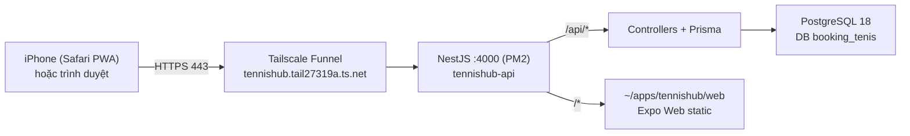

# deploy/ — bộ công cụ triển khai TennisHub

Máy dev là Windows nên **điểm vào là `deploy.ps1`**; phần chạy trên server là `remote-deploy.sh`.
Tất cả những bẫy đã gặp trong lần deploy đầu (mất `.env`, PowerShell ăn dấu ngoặc, CRLF, build sai platform)
đều đã được xử lý sẵn trong script.

## Kiến trúc production



| | |
|---|---|
| Server | `ssh 192.168.100.69` (user `khaipd-cloud`, Ubuntu) |
| Thư mục app | `~/apps/tennishub/{server,web}` |
| PM2 | `tennishub-api` (port 4000), bật cùng boot qua `pm2-khaipd-cloud.service` |
| URL công khai | https://tennishub.tail27319a.ts.net |
| **Máy dùng chung** | `mocphim-api` của project khác chiếm port 8080 — **script không đụng tới** |

Chỉ có **một origin**: NestJS phục vụ cả API lẫn bản web tĩnh (`server/src/main.ts`), nên không cần
Caddy/nginx và không phát sinh CORS.

## Chạy deploy

```powershell
# Từ gốc repo, trên máy dev
powershell -ExecutionPolicy Bypass -File deploy\deploy.ps1
```

Các cờ:

| Cờ | Khi nào dùng |
|---|---|
| `-SkipChecks` | Bỏ bước typecheck trước khi đóng gói (nhanh hơn, tự chịu rủi ro) |
| `-SkipWeb` | Chỉ deploy backend, giữ nguyên bản web đang chạy |
| `-SkipBackup` | Bỏ `pg_dump` trước khi deploy (không khuyến khích) |
| `-Server <host>` | Đổi máy đích (mặc định `192.168.100.69`) |

Script sẽ hỏi lại kết quả từng bước và **dừng ngay** (`set -euo pipefail` + kiểm tra `.env`) nếu có gì sai,
nên nếu deploy hỏng thì app cũ vẫn còn nguyên trong `dist/` cho tới khi build xong.

## Quy trình script thực hiện

**Trên máy dev (`deploy.ps1`):**

1. Typecheck `client` (`tsc --noEmit`) + `server` (`tsc --noEmit -p tsconfig.json`).
2. Build web: `EXPO_PUBLIC_API_URL=/api npx expo export --platform web --output-dir dist`
   → rồi copy `client/public/*` đè lên `dist/` để `manifest.json` và icon luôn mới nhất.
3. Kiểm tra bundle đã nhúng `/api` và **không còn** `localhost:4000` (đúng lỗi từng làm app không kết nối được).
4. `tar` `server/` (loại `node_modules`, `dist`, `.git`, `.env`, `.expo`) + `client/dist`.
5. `scp` hai file `.tgz` lên `/tmp/` của server, rồi gửi `remote-deploy.sh` qua base64 để chạy.

**Trên server (`remote-deploy.sh`):**

6. Backup `~/apps/tennishub/server/.env` và `pg_dump` DB ra `~/backup-before-deploy.dump`.
7. Xoá `server/` + `web/` cũ → giải nén → **phục hồi `.env`** → `chmod 600`, và **assert** có `DATABASE_URL` + `JWT_SECRET`.
8. `pnpm install --frozen-lockfile` → `prisma generate` → `prisma migrate deploy` → `nest build`.
9. `pm2 delete tennishub-api` (nếu có) rồi `pm2 start dist/main.js ...` → chờ `/api/health` trả 200 → `pm2 save`.
10. Kiểm tra `/api/health`, `/api/admin/events` (401 = route tồn tại), `/`, `/admin/`, `/bookings`.

Vì sao build **trên server**? `@prisma/client` sinh binary theo platform — build ở Windows rồi copy sang Linux
là hỏng engine. Bản web thì ngược lại: build ở máy dev để server không cần cả toolchain Expo.

## ⚠️ Hai điều bắt buộc nhớ

1. **Không bao giờ để `tar` chứa `server/.env`** — secret production (DATABASE_URL, JWT_SECRET,
   SEPAY_WEBHOOK_API_KEY) chỉ tồn tại trên server. Script đã lo việc backup/phục hồi; nếu tự viết lệnh
   giải nén thủ công thì phải làm đúng như bước 7 ở trên, nếu không app sẽ mất secret.
2. **KHÔNG đụng `mocphim-api`.** Đừng chạy `pm2 restart all`, `pm2 delete all` hay `pm2 flush` — chỉ thao tác
   đúng process `tennishub-api`.

## Secret nằm ở đâu

| Secret | Vị trí (chỉ trên server) |
|---|---|
| Mật khẩu DB | `~/.tennishub_db_pw` (chmod 600) |
| `JWT_SECRET`, `SEPAY_WEBHOOK_API_KEY`, `DATABASE_URL`, `CORS_ORIGIN`, `WEB_ROOT` | `~/apps/tennishub/server/.env` (chmod 600) |

`server/.env` và `client/.env` đều đã gitignore → không bao giờ lọt vào git.

## Lệnh vận hành thường dùng

```bash
ssh 192.168.100.69

pm2 list                              # trạng thái (để yên mocphim-api)
pm2 logs tennishub-api --lines 50     # log app
pm2 logs tennishub-api --err          # log lỗi
curl -s http://127.0.0.1:4000/api/health

tailscale funnel status               # trạng thái Funnel
sudo tailscale funnel --bg --https=443 http://127.0.0.1:4000   # bật lại nếu Funnel tắt (cần mật khẩu sudo)

# Backup DB thủ công
export PGPASSWORD="$(cat ~/.tennishub_db_pw)"
pg_dump -h 127.0.0.1 -U tennishub -d booking_tenis -Fc -f ~/backup-$(date +%F).dump
```

## Rollback

Mỗi lần deploy đều có `~/backup-before-deploy.dump` (DB) và bản build cũ bị xoá khỏi `server/`.
Cách nhanh nhất khi bản mới lỗi:

```bash
# 1. Trên máy dev: checkout commit cũ rồi deploy lại
git checkout <commit-cu>
powershell -ExecutionPolicy Bypass -File deploy\deploy.ps1

# 2. Nếu DB cũng hỏng thì restore dump đã backup
ssh 192.168.100.69 'export PGPASSWORD="$(cat ~/.tennishub_db_pw)"; \
  pg_restore -h 127.0.0.1 -U tennishub -d booking_tenis --clean --if-exists ~/backup-before-deploy.dump'
```

## Gỡ lỗi chính bộ kit này

Hai lỗi dưới đây từng làm `deploy.ps1` chết ngay khi vừa chạy (đã sửa, ghi lại để lần sau không sửa nhầm):

| Triệu chứng | Nguyên nhân thật | Cách xử lý |
|---|---|---|
| `The string is missing the terminator`, `Missing closing '}'`, `The Try statement is missing its Catch or Finally block` — báo ở những dòng **không hề liên quan** | File `.ps1` lưu **không có BOM** nhưng lại chứa ký tự non-ASCII. PowerShell 5.1 đọc file không BOM theo bảng mã ANSI, nên byte `0x94` (trong dấu `—`) và `0x91` (trong `đ`) biến thành `”` và `'` — mà PowerShell coi đó là **dấu nháy**, thế là chuỗi bị đóng sớm và parser báo lỗi lan tới tận cuối file. | Giữ file **UTF-8 có BOM**. Trong code chỉ dùng **ASCII**; dấu tiếng Việt/em-dash chỉ để trong khối comment `<# #>` (khối comment là vô hại). Kiểm tra BOM: `[IO.File]::ReadAllBytes('deploy\deploy.ps1')[0..2]` phải trả `239 187 191`. |
| Script chết ngay ở bước 1 với `npm notice ... NativeCommandError` | `$ErrorActionPreference = 'Stop'` khiến **mọi dòng stderr** của lệnh ngoài (`npx`, `tar`, `scp`, `ssh`) bị coi là lỗi nghiêm trọng. `npx` in dòng `npm notice` ra stderr là đủ để script tự sát. | Mọi lệnh ngoài phải đi qua hàm `Invoke-Native` có sẵn trong script — nó hạ tạm mức lỗi, in nguyên văn output (vẫn thấy tiến trình chạy) rồi mới kiểm tra mã thoát thật. |

Kiểm tra cú pháp `deploy.ps1` trước khi chạy:

```powershell
$errs = $null
[void][System.Management.Automation.Language.Parser]::ParseFile(
  (Resolve-Path deploy\deploy.ps1), [ref]$null, [ref]$errs)
$errs   # rỗng = cú pháp OK
```

Hai file `.sh` thì ngược lại: phải giữ **LF và KHÔNG có BOM** (BOM đầu file sẽ làm bash báo
`invalid option name`). Nếu máy dev có Git for Windows thì kiểm tra bằng:

```powershell
& 'C:\Program Files\Git\bin\bash.exe' -n deploy/remote-deploy.sh
```

## Dựng lại từ máy mới (disaster recovery)

Nếu laptop ở nhà hỏng phải thay máy khác, xem `bootstrap-server.sh` — script ghi lại toàn bộ các bước
cài đặt ban đầu (tạo role/DB, sinh secret, cài PM2 + Tailscale, bật Funnel).
